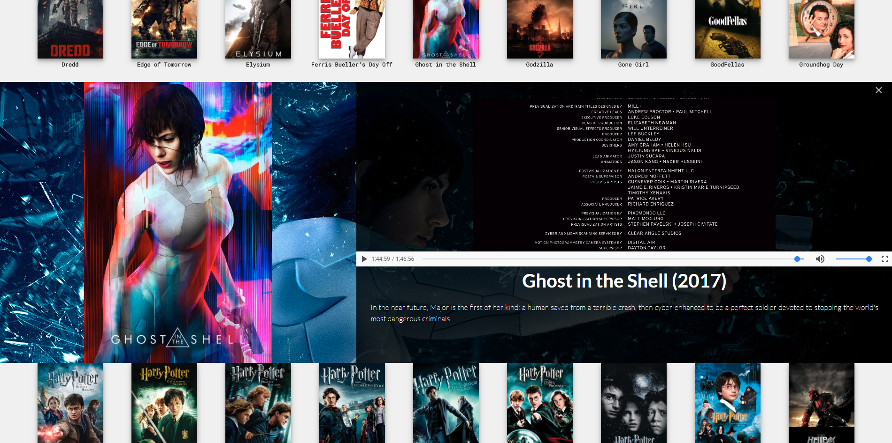
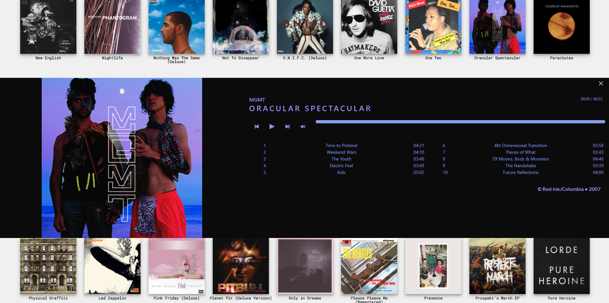

<p style="text-align: center;">


<p align="center">
  <a href="https://github.com/ridhwaans/homehost/issues"></a>
  <a href="https://github.com/ridhwaans/homehost/releases/"></a>
  <a href="https://github.com/ridhwaans/homehost/tags/"></a>
  <a href="https://github.com/ridhwaans/homehost/commit/"></a>
  <a href="https://github.com/ridhwaans/homehost/blob/master/LICENSE"></a>
</p>

<h3 align="center"> homehost is made for streaming your media collection over the home network </h3>
<h4 align="center"> Features: 🎥 Movies, 🎵 Music, 📺 TV Shows, 📚 Books, 📒 Comics, 🎙️ Podcasts </h4>

# 🎥 Movies

## [Demo](https://homehost-demo.herokuapp.com/movies)
[](https://homehost-demo.herokuapp.com/movies)
# 🎵 Music

## [Demo](https://homehost-demo.herokuapp.com/music)
[](https://homehost-demo.herokuapp.com/music)

# Setup

Run `npm install` under the client and server directories  
In `./config.yml`, set the media paths, and specify a working API key for TMDb API and Spotify Web API  
```yaml
# Server-side configs
movies:
  path  : '/path/to/movies/directory'
  api   : 'api.themoviedb.org/3'
  key   : '<api_key>'
music:
  path  : '/path/to/music/directory'
  api   : 'api.spotify.com/v1'
  key   : '<access_token>'
tv:
  path  : '/path/to/tv/directory'
  api   : 'api.themoviedb.org/3'
  key   : '<api_key>'
```
If you dont have keys, you can request API authorization from Spotify at https://developer.spotify.com/documentation/web-api/, and TMDb at https://developers.themoviedb.org/3/getting-started/introduction  

## Naming conventions

Your media must appear in the path set by `config.yml`  
🎥 **Movies**  
```
<movies_path>  
 - (subdirectory)?  
   - (movie_file_name <TMDb-movie-ID>) (.mp4|.mkv)
```
🎵 **Music**  
```
<music_path>  
 - (album_directory_name <Spotify-album-ID>)  
   - ((<disc_number>-)?<track_number> track_file_name) (.mp3|.flac)
```
Tracks not found on Spotify can be put in a directory titled `Unknown Album` sans disc/ track number
```
<music_path>  
 - Unknown Album  
   - (track_file_name) (.mp3|.flac)
```
📺 **TV**  
```
<tv_path>  
 - (tv_show_directory_name <TMDb-tv-ID>)  
   - (S<season_number>E<episode_number> episode_file_name) (.mp4|.mkv)
```
## Generating metadata

Server requires `<media>.json` file data at startup. Initial json state should be empty
```json
./movies.json, ./music.json, ./tv.json
{
  "movies": [], "music": [], "tv": []
}
``` 
From the base directory, run `yarn start-dev` to start homehost at `http://localhost:5000/`  
By default, express port is `5000`, webpack-dev-server is on `3000`  
On the server, call `/api/generate` **once**. Wait for the async call to finish and save  
There is no 'watch' or 'hot reload' for server media. Adding or changing media files requires a json reset and rerunning `/api/generate`  
**NOTE** `nodemon` will restart to file changes and interrupt async. Use `node server` instead for generating metadata.  

## Run
From the base directory, run `yarn start`

## Routes

### Server-side

**GET** `/api/hello`  
**GET** `/api/generate`  
**GET** `/api/movies`  
**GET** `/api/movies/:id`  
**GET** `/movies/:id`  
**GET** `/api/music/`  
**GET** `/api/music/albums/:id`  
**GET** `/music/:album_id/:disc_number/:track_number`  
**GET** `/api/tv/seasons/:id`  
**GET** `/tv/:show_id/:season_number/:episode_number`  

### Client-side

`/movies`, `/music`, `/tv` are accessible. `/books`, `/comics`, `/podcasts` are TODO

# Development

Works best in  Chrome. Coming to Desktop, iOS, Android.

# Powered by

<p>&emsp;</p>

# License

This project is licensed under the MIT License - see the [LICENSE.md](LICENSE.md) file for details

# Disclaimer

All pictures copyright to their respective owner(s). This project does not claim ownership of any of the pictures displayed on this site unless stated otherwise. This project does not knowingly intend or attempt to offend or violate any copyright or intellectual property rights of any entity. Some images used on this project are taken from the web and believed to be in the public domain. In addition, to the best of this project's knowledge, all content, images, photos, etc., if any, are being used in compliance with the Fair Use Doctrine (Copyright Act of 1976, 17 U.S.C. § 107.) The pictures are provided for comment/criticism/news reporting/educational purposes only.

Where every care has been taken to ensure the accuracy of the contents of this project, we do not warrant its completeness, quality and accuracy, nor can we guarantee that it is up-to-date. We will not be liable for any consequences arising from the use of, or reliance on, the contents of this project. The respective owners are exclusively responsible for external websites. This project accepts no liability of the content of external links.

Our project follows the safe harbor provisions of 17 U.S.C. §512, otherwise known as Digital Millennium Copyright Act (“DMCA”).

If any images posted here are in violation of copyright law, please contact us and we will gladly remove the offending images immediately upon receipt of valid proof of copyright infringement.

## General Copyright Statement  
Most of the sourced material is posted according to the “fair use” doctrine of copyright law for non-commercial news reporting, education and discussion purposes. We comply with all takedown requests.

You may not use the Service for any illegal or unauthorized purpose. You must not, in the use of the Service, violate any laws in your jurisdiction (including but not limited to copyright or trademark laws).