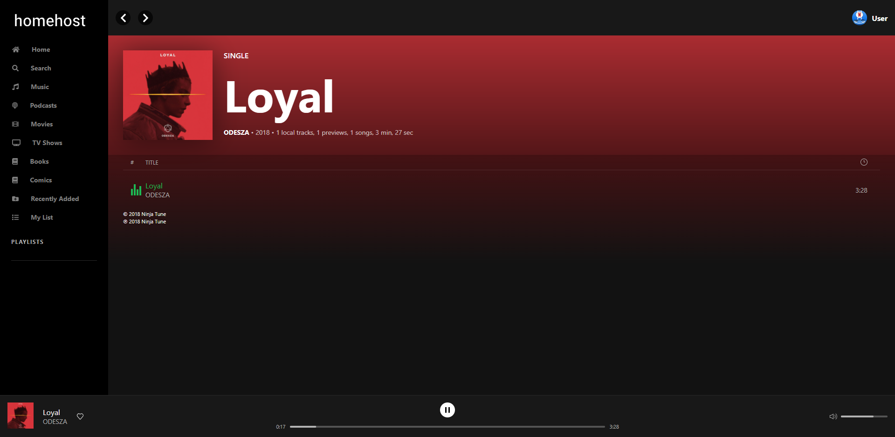

<h2 align="center"> homehost </h2>

<h3 align="center"> homehost is made for streaming your media collection within the home network </h3>
<h4 align="center"> Features: 🎥 Movies, 📺 TV Shows, 🎵 Music </h4>

- [🎥 Movies](#-movies)
- [📺 TV Shows](#-tv-shows)
- [🎵 Music](#-music)
- [⚙️ Setup](#%EF%B8%8F-setup)
  - [Naming conventions](#naming-conventions)
  - [Database](#database)
  - [Run](#run)
  - [Routes](#routes)
    - [Server-side](#server-side)
    - [Client-side](#client-side)
- [Development](#development)
- [Powered by](#powered-by)
- [License](#license)
- [Disclaimer](#disclaimer)
  - [General Copyright Statement](#general-copyright-statement)

## 🎥 Movies

### Home


### Search


## 📺 TV Shows

### Home


## 🎵 Music

### Home


### Search


### Album



## ⚙️ Setup

Run `npm run install-packages`

In `.env`, set a working API key for TMDb API and Spotify Web API, set the media paths, and set tha base url of the homehost client

######

```env
# packages/client/.env
REACT_APP_HOMEHOST_BASE = "http://localhost:5000"
REACT_APP_IMAGE_BASE = "https://image.tmdb.org/t/p/"
REACT_APP_IMDB_BASE = "https://www.imdb.com"

# packages/server/.env
TMDB_KEY = '<api_key>'
SPOTIFY_CLIENT_ID = '<client_id>'
SPOTIFY_CLIENT_SECRET = '<client_secret>'

MOVIES_PATH = '/path/to/movies/directory'
TV_PATH = '/path/to/tv/directory'
MUSIC_PATH = '/path/to/music/directory'

DATABASE_URL = 'file:./data/media.db'
CLIENT_BASE_URL = 'http://localhost:3000'
```

If you dont have keys, you can request API authorization from Spotify at https://developer.spotify.com/documentation/web-api/, and TMDb at https://developers.themoviedb.org/3/getting-started/introduction

### Media

Your media must appear in the absolute path locations set by `.env`. Each media must be in a unique location and cannot share the same directory path(s)  

#### Naming conventions

🎥 **Movies**

```
<movies_path>
- (subdirectory)?
  - (movie_file_name <TMDb-movie-ID>) (.mp4|.mkv)
```

📺 **TV**

```
<tv_path>
- (tv_show_directory_name <TMDb-tv-show-ID>)
  - (S<season_number>E<episode_number> episode_file_name) (.mp4|.mkv)
```

🎵 **Music**

```
<music_path>
- (album_directory_name <Spotify-album-ID>)
  - ((<disc_number>-)?<track_number> track_file_name) (.mp3|.flac)
```

Tracks not found on Spotify can be put in a directory titled `Unknown Album` sans disc/ track number

```
<music_path>
- Unknown Album
  - (track_file_name) (.mp3|.flac)
```

### Database
  
Run `npm run db:migrate` to create migrations from schema, apply them, generate the database client  
_homehost_ scans the media paths and adds the files to the database  
Wait for the async job to finish generating metadata and save  
To browse data, run `npm run db:browse` and go to `http://localhost:5555`  
To clear all data, run `npm run db:clear`

### Run

Run `npm run start` to start the application  
By default, the server port is `5000`, client port is `3000`  
Run `npm run start:prod` to start the application as prod (default port is `5000`)  
While running, _homehost_ continuously saves and retrieves information for any media that was added, moved or removed

### Routes

#### Server-side
 
**GET**  
`/api/about`  
`/api/library/stats`  
`/api/not_available`  
`/api/movies`  
`/api/movies/most_popular`  
`/api/movies/highest_rated`  
`/api/movies/recently_added`  
`/api/movies/genres`  
`/api/movies/genre/:name`  
`/api/movies/random`  
`/api/movies/:id`  
`/api/tv`  
`/api/tv/most_popular`  
`/api/tv/highest_rated`  
`/api/tv/recently_added`  
`/api/tv/genres`  
`/api/tv/genre/:name`  
`/api/tv/random`  
`/api/tv/:id`  
`/api/music/albums/recently_added`  
`/api/music/albums/latest`  
`/api/music/artists`  
`/api/music/artists/most_popular`  
`/api/music/albums`  
`/api/music/albums/:id`  
`/api/music/songs`  
`/api/music/songs/recently_added`  
`/movies/:id`  
`/tv/:tv_show_id/:season_number/:episode_number`  
`/music/:album_id/:disc_number/:track_number`  
`/api/watch/search`  
`/api/listen/search`  
`/api/watch/billboard`

#### Client-side

`/movies`, `/tv`, `/music`

## Development

Works best in  Chrome. Coming to Desktop, iOS, Android.

## Powered by

<p>&emsp;</p>

## Contributing

See [CONTRIBUTING.md](.github/CONTRIBUTING.md).

## License

This project is licensed under the MIT License - see the [LICENSE](LICENSE) file for details

## Disclaimer

All pictures copyright to their respective owner(s). This project does not claim ownership of any of the pictures displayed on this site unless stated otherwise. This project does not knowingly intend or attempt to offend or violate any copyright or intellectual property rights of any entity. Some images used on this project are taken from the web and believed to be in the public domain. In addition, to the best of this project's knowledge, all content, images, photos, etc., if any, are being used in compliance with the Fair Use Doctrine (Copyright Act of 1976, 17 U.S.C. § 107.) The pictures are provided for comment/criticism/news reporting/educational purposes only.

Where every care has been taken to ensure the accuracy of the contents of this project, we do not warrant its completeness, quality and accuracy, nor can we guarantee that it is up-to-date. We will not be liable for any consequences arising from the use of, or reliance on, the contents of this project. The respective owners are exclusively responsible for external websites. This project accepts no liability of the content of external links.

Our project follows the safe harbor provisions of 17 U.S.C. §512, otherwise known as Digital Millennium Copyright Act (“DMCA”).

If any images posted here are in violation of copyright law, please contact us and we will gladly remove the offending images immediately upon receipt of valid proof of copyright infringement.

### General Copyright Statement

Most of the sourced material is posted according to the “fair use” doctrine of copyright law for non-commercial news reporting, education and discussion purposes. We comply with all takedown requests.

You may not use the Service for any illegal or unauthorized purpose. You must not, in the use of the Service, violate any laws in your jurisdiction (including but not limited to copyright or trademark laws).